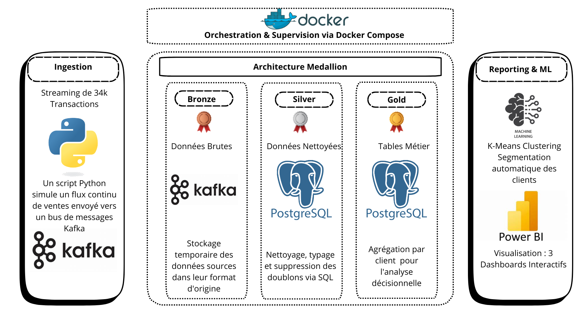
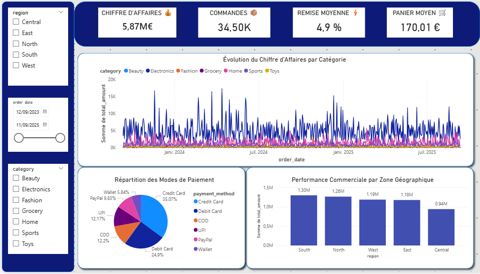
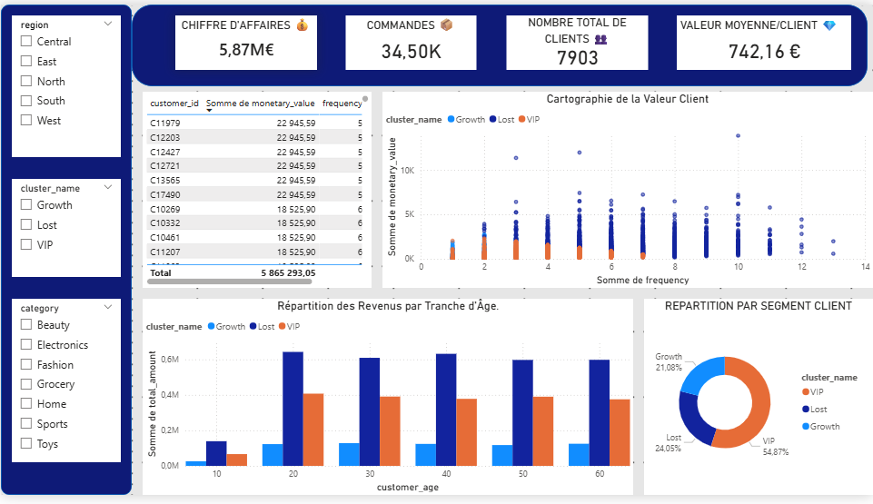
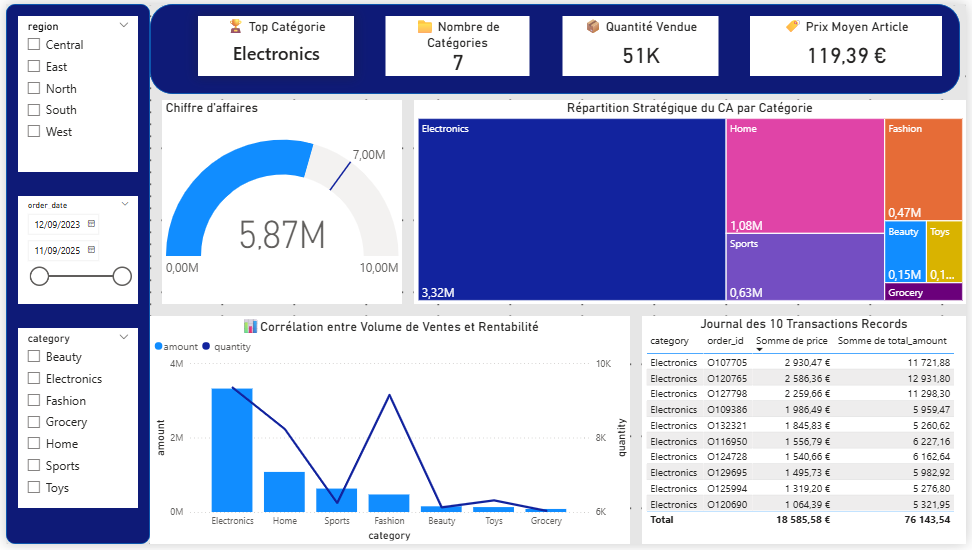

#  E-Commerce Medallion Architecture & ML Clustering

Ce projet implémente une plateforme de données de bout en bout, de l'ingestion de flux de transactions en temps réel jusqu'à la segmentation client avancée par IA.

###  Architecture Technique
- **Ingestion (Bronze)** : Simulation de 34k transactions via **Python** & **Kafka**.
- **Transformation (Silver)** : Nettoyage et structuration SQL.
- **Analytique & IA (Gold)** : Calcul des KPIs métier et modèle de clustering **K-Means**.
- **Orchestration** : **Docker Compose** pour une infrastructure isolée et reproductible.
- **Visualisation** : **Power BI** (Dashboards de performance, segmentation, et analyse produits).
  

###  Points Clés
- Architecture Medallion respectant les standards industriels.
- Traitement de données massives .
- Modèle ML intégré pour la personnalisation marketing.
  
  ##  Dashboards & Visualisation
Voici les résultats finaux de l'analyse, connectés directement à la couche **Gold** de l'architecture Medallion.

### 1. Performance des Ventes

### 2. Intelligence Client (Segmentation RFM)

### 3. Analyse des Produits

